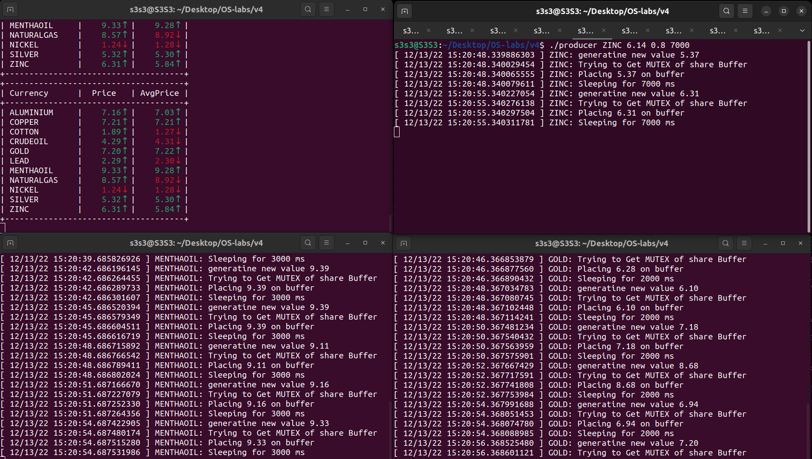
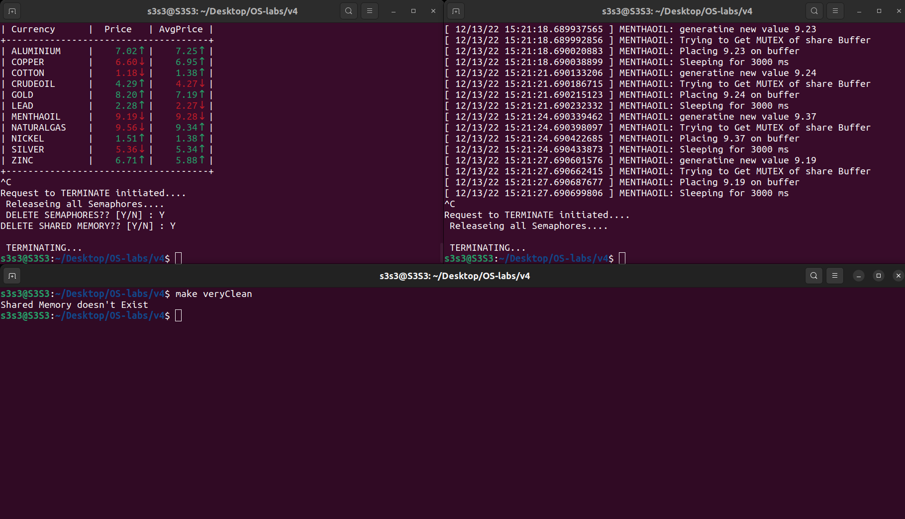

# CONSUMER PRODUCER PROBLEM
## Goal:
#### SOLVE THE CONSUMER PRODUCER PROBLEM USING SEMAPHORES FOR ACCESSING THE SHARED MEMORY BUFFER
## Structure Used
- Semaphores from System V library
- Shared memory from System V library
<br>

## Description:
#### Shared memory is represented by a consecutive amount of bytes decided and created by the consumer on its call `./consumer (size)`. We access these bytes as a string where we save only characters in it.
#### Shared memory string is in the form of (commodity,price) each in a separate line in the same string to prevent multiple pointers.
#### The producer uses this memory by tokenizing the first line and removing that line from the whole string.
#### The consumer uses this memory by concatenating a new line to the string.
<br>

## CODE: 
### Consumer
> Consumer is responsible in this code to generate both the semaphores and the shared memory
- We have a map in the form of:

|    Commodity      |   INDEX  	|
| :-----------: | :----------:  |
| 	ALUMINIUM	| 0  |
| COPPER | 1  |
| COTTON | 2  |
| CRUDEOIL | 3  |
| GOLD | 4  |
| LEAD | 5  |
| MENTHAOIL | 6  |
| NATURALGAS | 7  |
| NICKEL | 8  |
| SILVER | 9  |
| ZINC	| 10  |
- Then there is the initialization:

``` C    
// Get max number of items on buffer and initialize memsize
BOUND = stoi(argv[1]);
memsize = BOUND * 32;
// initialize semaphores buffer struct
asem [0].sem_num = 0;
asem [0].sem_op = 0;
asem [0].sem_flg = 0;
// Initialize memory and semaphores
initMemSem();
```
- This is init memory and semaphore function in the previous part:
``` C
void initMemSem(){
	// ftok to generate unique key for shared memory
	if ((key = ftok(shmkey,65)) == -1) {
       		perror ("ftok"); exit(1);
    	}
	// shmget returns an identifier in shmid
	if ( (shmid = shmget(key,memsize,0666|IPC_CREAT)) < 0 ) {
		perror("shmget"); exit(1);
	}
	// put shared memory in str
	str= (char*) shmat(shmid,(void*)0,0);
	// ftok to generate unique key for Mutex
	if ((key = ftok(msemkey,65)) == -1) {
       		perror ("ftok Mutex"); exit(1);
    	}
    	// Create  Mutex Semaphore
	if ((mutex_sem = semget (key, 1, 0666 | IPC_CREAT)) == -1) {
        	perror ("semget Mutex"); exit (1);
    	}
    	// Giving initial value. 
	sem_attr.val = 1;      
	if (semctl (mutex_sem, 0, SETVAL, sem_attr) == -1) {
		perror ("semctl Mutex SETVAL"); exit (1);
	}
	// ftok to generate unique key for consumer
	if ((key = ftok(csemkey,65)) == -1) {
       		perror ("ftok Con"); exit(1);
    	}
    	// Create  consumer Semaphore ( Indicates number of available items on the buffer )
	if ((con_sem = semget (key, 1, 0666 | IPC_CREAT)) == -1) {
        	perror ("semget Con"); exit (1);
    	}
    	// Giving initial value. 
	sem_attr.val = 0;      
	if (semctl (con_sem, 0, SETVAL, sem_attr) == -1) {
		perror ("semctl Con SETVAL"); exit (1);
	}
	// ftok to generate unique key for producer
	if ((key = ftok(psemkey,65)) == -1) {
       		perror ("ftok Prod"); exit(1);
    	}
    	// Create  producer Semaphore ( Indicates number of available places on the buffer )
	if ((prod_sem = semget (key, 1, 0666 | IPC_CREAT)) == -1) {
        	perror ("semget Prod"); exit (1);
    	}
    	// Giving initial value. 
	sem_attr.val = BOUND;      
	if (semctl (prod_sem, 0, SETVAL, sem_attr) == -1) {
		perror ("semctl Prod SETVAL"); exit (1);
	}
}
```
- Finally we have the inifinite loop:
``` C
while(true) {
	// Check if you can take an item from the buffer
	asem[0].sem_op=-1;
	if (semop (con_sem, asem, 1) == -1) {
   		perror ("semop: con_sem"); exit (1);
	}
	// Get Mutual Execlusion
	asem[0].sem_op=-1;
	if (semop (mutex_sem, asem, 1) == -1) {
   		perror ("semop: mutex_sem"); exit (1);
	}
	// Critical Section Begin
	string tmp = str;
	string tmp2 = tmp.substr(0, tmp.find("\n"));
	tmp.erase(0, tmp.find("\n") + 1);
	strcpy(str, tmp.c_str());
	// Critical Section End
	// Release Mutual Execlusion
	asem[0].sem_op=1;
	if (semop (mutex_sem, asem, 1) == -1) {
   		perror ("semop: mutex_sem"); exit (1);
	}
	// Add empty space on buffer
	asem[0].sem_op=1;
	if (semop (prod_sem, asem, 1) == -1) {
   		perror ("semop: prod_sem"); exit (1);
	}
// Fill and print vector of deques
	fill(v, tmp2);
	printCon(v);
}
```
- This code is for safe exiting and checks if the user wants to delete memory and semaphores:
``` C
// Handles ctrl C
void handler_function(int sig){
	printf("\nRequest to TERMINATE initiated....\n ");
	printf("Releaseing all Semaphores....\n ");
	end();
}

// Check if user wants to deleter shared memory or semaphores
void end(){
	shmdt(str);
	printf("DELETE SEMAPHORES?? [Y/N] : ");
	char c;
	cin >> c;
	if ( c == 'Y' || c == 'y' ) {
		// remove semaphores
		if (semctl (mutex_sem, 0, IPC_RMID) == -1) {
			perror ("semctl IPC_RMID"); exit (1);
		}
		if (semctl (prod_sem, 0, IPC_RMID) == -1) {
			perror ("semctl IPC_RMID"); exit (1);
		}
		if (semctl (con_sem, 0, IPC_RMID) == -1) {
			perror ("semctl IPC_RMID"); exit (1);
		}
	}
	printf("DELETE SHARED MEMORY?? [Y/N] : ");
	cin >> c;
	if ( c == 'Y' || c == 'y' ) {
		shmctl(shmid,IPC_RMID,0);
	}
	printf("\n TERMINATING...\n");
	exit(0);
}
```
* In the end of each loop  the consumer prints the current prices and average for the last five prices.

### Producer:
- Producer has the same code with small differences:
1. Producer Cannot create semaphores or buffers only calls them
2. Producer has EXITVAL global variables used for same
- Producer while loop:
``` C
// infinite loop to run the producer unitl ctrl C is hit
while(true) {
	// Check if exit is called
	if ( EXITVAL ) end();
	// get price from distribution
	double price = distribution(generator);
	price = abs(price);
	// Get time in gmt and add 2 hours to be in local time
	clock_gettime( CLOCK_REALTIME ,&ts );
	ts.tv_sec += 7200;
	strftime(buff, sizeof buff, "%D %T", gmtime(&ts.tv_sec));
	fprintf(stderr,"[ %s.%03ld ] %s: generatine new value %.2lf\n",buff, ts.tv_nsec,tmp.c_str(),price);
	// Check if you can take an item from the buffer
	asem[0].sem_op=-1;
	if (semop (prod_sem, asem, 1) == -1) {
   		perror ("semop: con_sem"); exit (1);
	}
	// Try to get mutex time and flag
	clock_gettime( CLOCK_REALTIME ,&ts );
	ts.tv_sec += 7200;
	strftime(buff, sizeof buff, "%D %T", gmtime(&ts.tv_sec));
	fprintf(stderr,"[ %s.%03ld ] %s: Trying to Get MUTEX of share Buffer\n",buff, ts.tv_nsec,tmp.c_str());
	// Get Mutual Execlusion
	asem[0].sem_op=-1;
	if (semop (mutex_sem, asem, 1) == -1) {
   		perror ("semop: mutex_sem"); exit (1);
	}
	// Critical Section Begin
	string s = tmp;
	s = s + ',' + to_string(price);
	s = str + s + '\n';
	strcpy(str, s.c_str());
	// End of Critical Section
	clock_gettime( CLOCK_REALTIME ,&ts );
	ts.tv_sec += 7200;
	strftime(buff, sizeof buff, "%D %T", gmtime(&ts.tv_sec));
	fprintf(stderr,"[ %s.%03ld ] %s: Placing %.2lf on buffer\n",buff, ts.tv_nsec,tmp.c_str(),price);
	// Release Mutual Execlusion
	asem[0].sem_op=1;
	if (semop (mutex_sem, asem, 1) == -1) {
   		perror ("semop: mutex_sem"); exit (1);
	}
	// Add item on buffer
	asem[0].sem_op=1;
	if (semop (con_sem, asem, 1) == -1) {
   		perror ("semop: prod_sem"); exit (1);
	}
	if ( EXITVAL ) end();
	clock_gettime( CLOCK_REALTIME ,&ts );
	ts.tv_sec += 7200;
	strftime(buff, sizeof buff, "%D %T", gmtime(&ts.tv_sec));
	fprintf(stderr,"[ %s.%03ld ] %s: Sleeping for %d ms\n",buff, ts.tv_nsec,tmp.c_str(),(int)slp*1000);
	// Sleep
	sleep(slp);
}
```

### Clean:
- This code deletes all shared memory and semaphores:
``` C
void memDel(){

    struct shmid_ds shm_info;
    struct shmid_ds shm_segment;
    int max_id = shmctl(0,SHM_INFO,&shm_info);
    if (max_id>=0){
        for (int i=0;i<=max_id;++i) {
                int shm_id = shmctl(i , SHM_STAT , &shm_segment);
                if (shm_id<=0)
                    continue;
                else if (shm_segment.shm_nattch==0){
                    delete_segment(shm_id);
                }
        }
    }
    return;
}

int main()
{	
	//signal(SIGINT, handler_function);
    // ftok to generate unique key
	key = ftok(shmkey,65);
  
    // shmget returns an identifier in shmid
    int shmid = shmget(key,0,0);
    if ( shmid < 0 ) {
    	cout << "Shared Memory doesn't Exist" << endl;
    }
    // Destroy the shared memory  
    shmctl(shmid,IPC_RMID,NULL);
    
    // ftok to generate unique key for Mutex
	if ((key = ftok(msemkey,65)) == -1) {
   		perror ("ftok Mutex"); exit(1);
	}
	// Create  Mutex Semaphore
	if ((mutex_sem = semget (key, 1, 0666 | IPC_CREAT)) == -1) {
    	perror ("semget Mutex"); exit (1);
	}
	// ftok to generate unique key for consumer
	if ((key = ftok(csemkey,65)) == -1) {
   		perror ("ftok Con"); exit(1);
	}
	// Create  consumer Semaphore ( Indicates number of available items on the buffer )
	if ((con_sem = semget (key, 1, 0666 | IPC_CREAT)) == -1) {
    	perror ("semget Con"); exit (1);
	}
	// ftok to generate unique key for producer
	if ((key = ftok(psemkey,65)) == -1) {
   		perror ("ftok Prod"); exit(1);
	}
	// Create  producer Semaphore ( Indicates number of available places on the buffer )
	if ((prod_sem = semget (key, 1, 0666 | IPC_CREAT)) == -1) {
    	perror ("semget Prod"); exit (1);
	}
    
    
    // remove semaphores
    if (semctl (mutex_sem, 0, IPC_RMID) == -1) {
        perror ("semctl IPC_RMID"); exit (1);
    }
    if (semctl (prod_sem, 0, IPC_RMID) == -1) {
        perror ("semctl IPC_RMID"); exit (1);
    }
    if (semctl (con_sem, 0, IPC_RMID) == -1) {
        perror ("semctl IPC_RMID"); exit (1);
    }
	memDel();
    return 0;
}
```


## Sample Runs:
> Running Consumer with max buffer of 10 items after running the make file
- Picture one shows consumer and one producer

- Picture shows consumer with 11 producers

- Picture shows ending consumer and deleting semaphores and shared memory (make veryClean cannot find shared memory as it is alread deleted by consumer)



